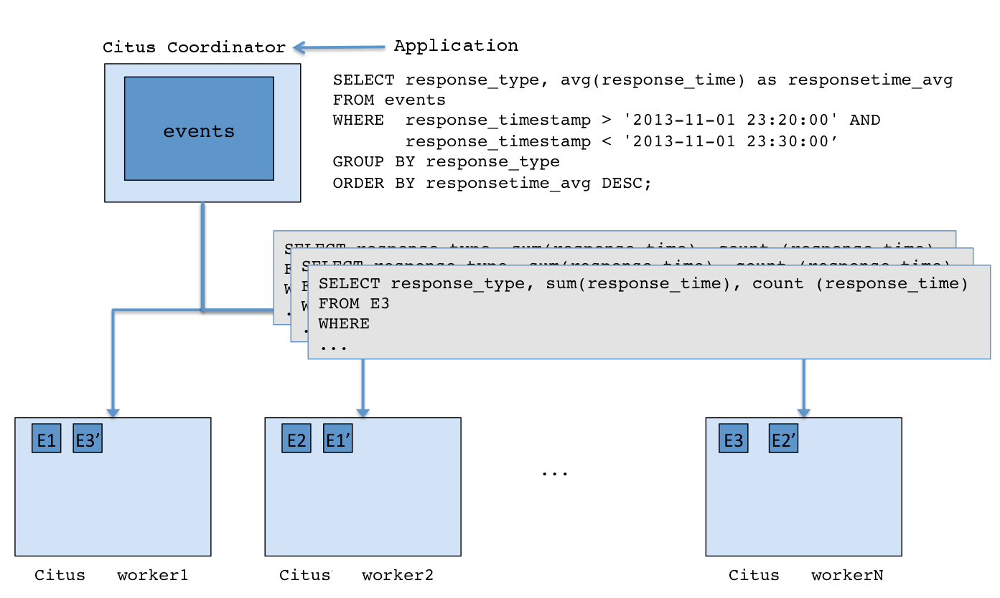

# PostgreSQL Schema design and optimization using citus extension
This schema supports scalability, data normalization, efficient querying, partitioning and Sharding strategies for optimal performance.

##Instructions
### Prerequisites

- PostgreSQL cluster, with optional shard nodes with the citus extention enabled.
```console
create extension citus;
```

###Architecture
This is the architectural diagram of how the solution looks like.


## Sharding strategy

Citus uses the distribution column in distributed tables to assign table rows to shards (workers). Choosing the distribution column for each table is one of the most important modeling decisions because it determines how data is spread across nodes. In this scenario, we will use the company_id column. This will ensure company related data will be grouped together on the same physical nodes, making queries fast and adding support for all SQL features. 

1. Create distributed table using the `company_id` column. This will ensure that data for each companies will be in the same node, which avoids sending data over the network during joins. This will result in faster operations.
```console
SELECT create_distributed_table('transaction', 'company_id');
```
2. Since the `companies`, `countries` and `industry_types` tables are unlikely to grow big, we will create them as reference tables. these are distributed into a single shard and replicating the shard to every worker node. This will eliminate network overhead.
```console
SELECT create_reference_table('companies');
SELECT create_reference_table('countries');
SELECT create_reference_table('industry_types');
```
3. To optimize for performance, we will do a time-based partitioning. This will help us with:
- Smaller and faster indices within each date range.
- Most queries access a very small subset of the most recent data.
- Older data is periodically expired (deleted/dropped).
With smaller partitions, indices are likely to fit in memory and cache leading to fast queries.
We will partition the table using the `recorded_at` column to contain data for every month, for the next 12 months.
```console
SELECT create_time_partitions(
  table_name         := 'transaction',
  partition_interval := '1 month',
  end_at             := now() + '12 months'
);
```
Check the created partitions.
```console
SELECT partition
  FROM time_partitions
 WHERE parent_table = 'transaction'::regclass;
 ```
4. Create a cron job to ensure we have 12 months of partitions, as well as drop old partitions using `pg_cron`.
```console
SELECT cron.schedule('create-partitions', '0 0 1 * *', $$
  SELECT create_time_partitions(
      table_name         := 'transaction',
      partition_interval := '1 month',
      end_at             := now() + '12 months'
  )
$$);
```
```console
SELECT cron.schedule('drop-partitions', '0 0 1 * *', $$
  CALL drop_old_time_partitions(
      'transaction',
      now() - interval '12 months' /* older_than */
  );
$$);
```
5. Vertical scaling can be utilized for shards that have data that is heavily accessed. This can also be used if the data retention period is longer and more storage is required. However, this would be best resolved using a reporting database or a datalake.

